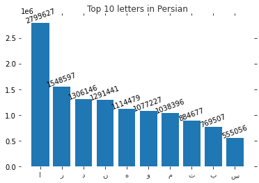
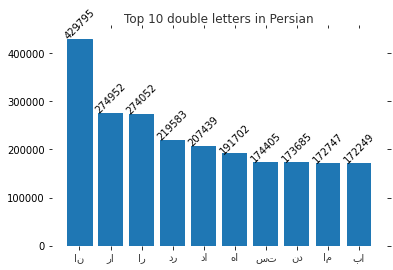

# INTRODUCTION
frequency analysis is one of the know cipher attacks. It is based on the study of the frequency of letters or groups of letters in a ciphertext. In all languages, this frequency is different from one letter to another. The proportion of appearance of some letters are much more than some rare letters. For instance, in English, letters e, o and a are more common than the letters z or x. Knowing the fact that the frequencies can be determined only approximately due to the fact that it is depending on the kind of the text is important. For example, related words used in medical texts are different from words in news. Also each language has some typical and popular sequence of letters known as n-grams. 

In this experiment, I found the frequency of letters and bigrams in Persian language using [Persica-A](https://sourceforge.net/projects/persica/) which is a copus for NEWS articles in Persian.
#### citation
title={Persica: A Persian corpus for multi-purpose text mining and Natural language processing},
author={Eghbalzadeh, Hamid and Hosseini, Behrooz and Khadivi, Shahram and Khodabakhsh, Ali},
booktitle={Telecommunications (IST), 2012 Sixth International Symposium on},
pages={1207--1214},
year={2012},
organization={IEEE}
}

# DESCRIPTION
Initially, after loading the corpus and merging the articles, puctuations and non-Persian alphabet, numbers and symbols have removed by customized function called punctuation. After this step, remaining letters are all Persian. Next, each letter in text is counted by custom function named single_letters. Actually they've saved in python dictionary. Then letters in Persian alphabet seprated from the other. Total number of alphabetical letters are 16605664. So the result is: 
{'و': 1077227,
 'ز': 395592,
 'ر': 1548597,
 'ع': 256771,
 'ل': 469381,
 'م': 1038396,
 'د': 1306146,
 'ج': 217349,
 'ا': 2795627,
 'س': 555056,
 'ت': 884677,
 'ن': 1291441,
 'ه': 1114479,
 'ش': 480706,
 'گ': 257452,
 'ف': 256347,
 'ظ': 45306,
 'ح': 186178,
 'ب': 769507,
 'ق': 219953,
 'خ': 216698,
 'ص': 123949,
 'آ': 121403,
 'چ': 53275,
 'ط': 104225,
 'پ': 103132,
 'ض': 60121,
 'ذ': 34385,
 'ژ': 16399,
 'غ': 30654,
 'ک': 20179}

In order to find bigrams, a frame lengthed 2 letters, counted sequential letters. For example, my name is Parham, in Persian it's پرهام
these sequences counted like پر، ره، ها، ام
At the end, 10 most frequent letters and bigrams reported as below.

10 most frequent letters in Persian
{'ا': 2795627, 'ر': 1548597, 'د': 1306146, 'ن': 1291441, 'ه': 1114479, 'و': 1077227, 'م': 1038396, 'ت': 884677, 'ب': 769507, 'س': 555056} 

10 most double frequent letters in Persian
{'ان': 429795, 'را': 274952, 'ار': 274052, 'در': 219583, 'دا': 207439, 'ها': 191702, 'ست': 174405, 'ند': 173685, 'ام': 172747, 'با': 172249}

Finally, this information Indicated using matplotlib.

and
